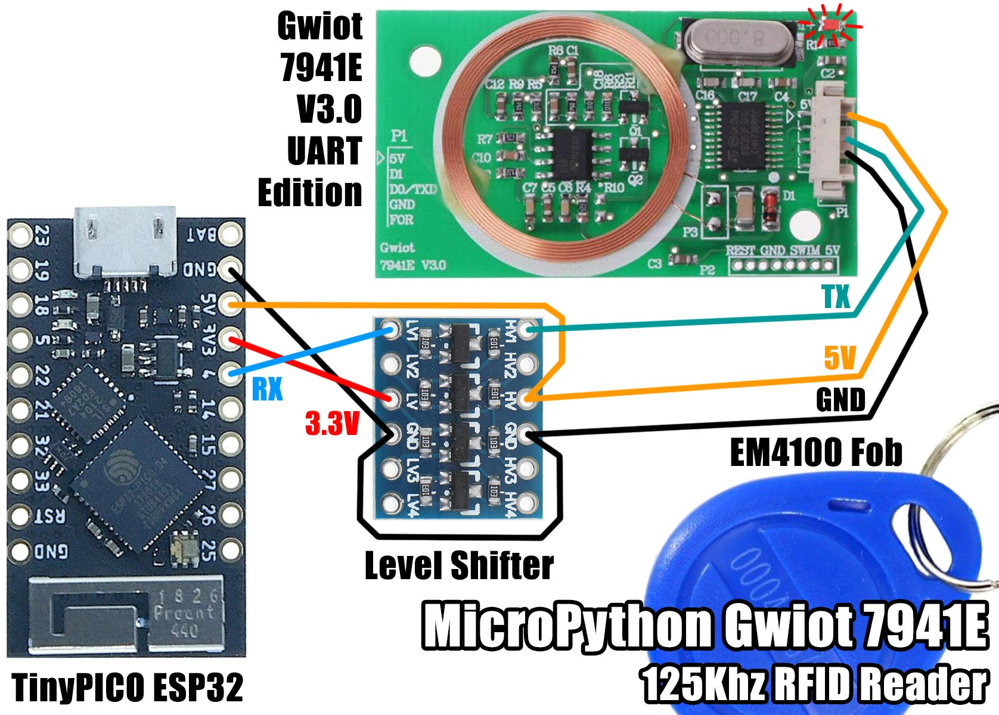

# MicroPython Gwiot 7941E 125 KHz RFID Reader

I am using a V3.0 board. There are a bunch of other boards at: https://gwiot.com/

## License

Licensed under the [MIT License](http://opensource.org/licenses/MIT).

Copyright (c) 2020 Mike Causer
